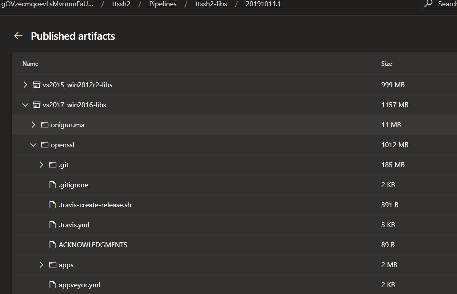
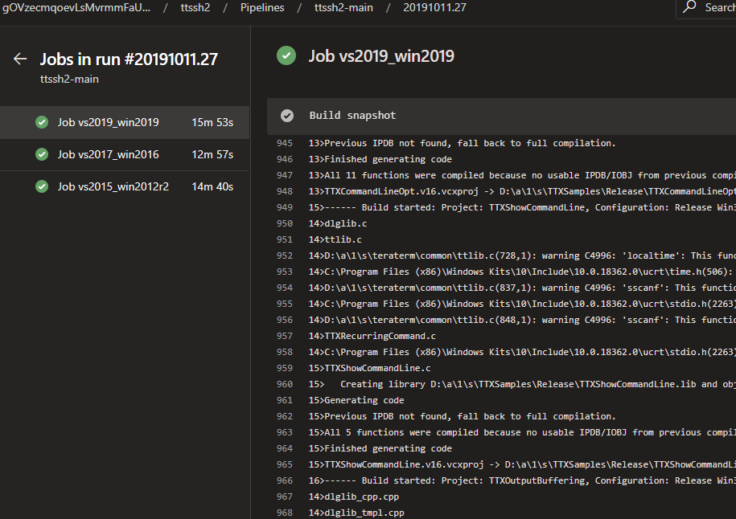
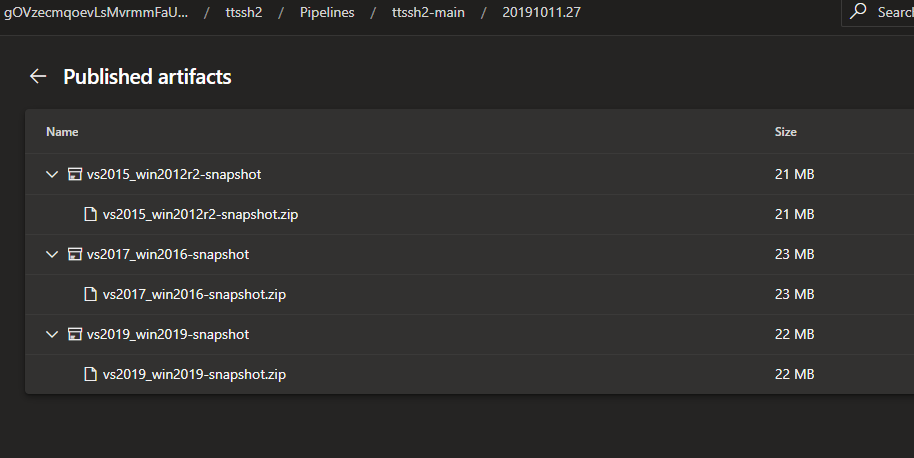

# ci/azure-pipelines

[Microsoft Azure Devops](https://azure.microsoft.com/ja-jp/services/devops/) でsnapshotビルドするためのYAMLファイル

このCIでビルドしたバイナリは、__Win9x では動きません。__

VisualStudio各バージョンのビルド確認用に使ってください。

## 対応するVisual StudioとWindowsコンテナ(ms hosted)
- vs2019_win2019 (VS2019 Enterprise + Windows Server 2019)
- vs2017_win2016 (VS2017 Enterprise + Windows Server 2016)
- vs2015_win2012r2 (VS2015 + Windows Server 2012R2)

## ライブラリのビルド (azure-pipelines-libs.yml)
Tera Term のビルドに先立って、必要なライブラリを構築します。
- Oniguruma
- OpenSSL
- PuTTY (fetchのみ)
- SFMT
- Zlib

SCMのコミットにフックして都度構築する必要はありません。

新規に構築するときや、ライブラリを更新したときなどに実行してください。



### ライブラリの更新
YAMLファイルの `variables:` に各ライブラリの取得元Gitリポジトリとリリースタグを設定しています。

ライブラリのバージョンを変更するときは、`REPOS_(ライブラリ名)_TAG`のタグを変更し、再構築してください。

```
variables:
  REPOS_ONIGURUMA_URL: 'https://github.com/kkos/oniguruma.git'
  REPOS_ONIGURUMA_TAG: 'v6.9.3'
  REPOS_OPENSSL_URL: 'https://github.com/openssl/openssl.git'
  REPOS_OPENSSL_TAG: 'OpenSSL_1_0_2t'
  REPOS_PUTTY_URL: 'https://git.tartarus.org/simon/putty.git'
  REPOS_PUTTY_TAG: '0.70'
  REPOS_SFMT_URL: 'https://github.com/MersenneTwister-Lab/SFMT.git'
  REPOS_SFMT_TAG: '1.5.1'
  REPOS_ZLIB_URL: 'https://github.com/madler/zlib.git'
  REPOS_ZLIB_TAG: 'v1.2.11'
```

## Tera Term のビルド (azure-pipelines-main.yml)
構築したライブラリのアーティファクトを取得して、Tera Term をビルドします。

ビルドが完了すると、ZIP圧縮されたsnapshotが構築した環境ごとにアーティファクトに出力されます。



